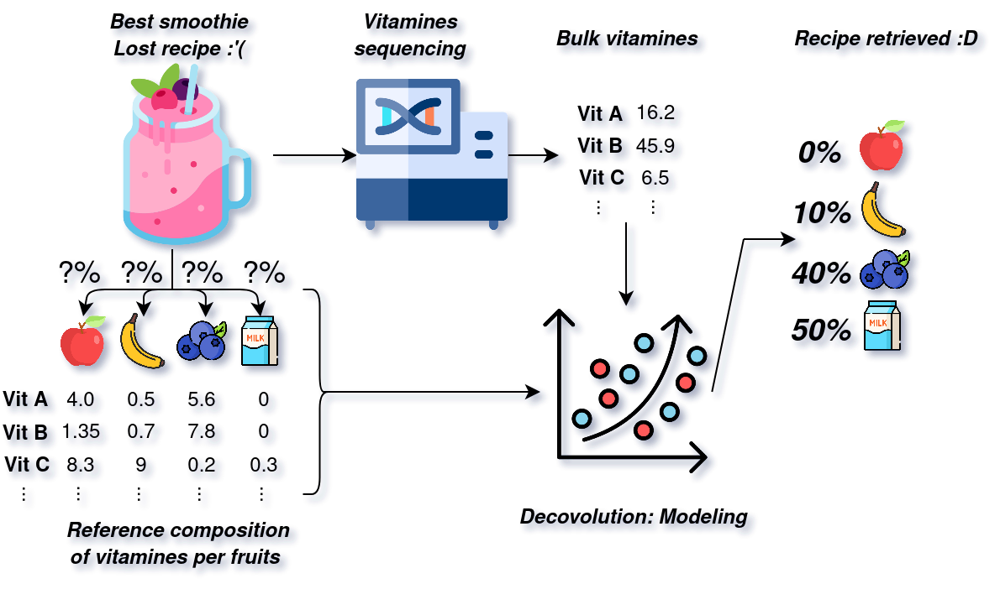

The objective of this challenge is to estimate the fruit composition of different smoothies (mixtures to be deconvoluted) based on the vitamin composition of the smoothie, using the exact vitamin composition of each fruit (reference profile).

